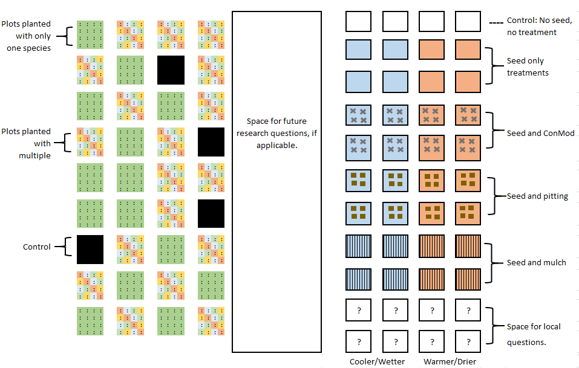

```{r setup, include=FALSE}
knitr::opts_chunk$set(echo = TRUE)
```

## RestoreNet

Take this [idea](https://www.usgs.gov/centers/sbsc/science/restorenet-distributed-field-trial-network-dryland-restoration?qt-science_center_objects=0#qt-science_center_objects) and extend.

  

### Innovations
1. Gradient - Mojave, Carrizo, Panoche.  
2. Measure inverts in and out.  
3. Cam trap exclosures.  
4. Measure dark div in region of plants, inverts, and birds.  

